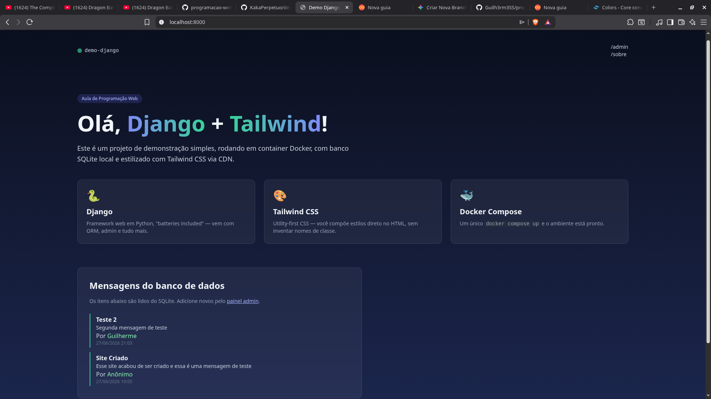
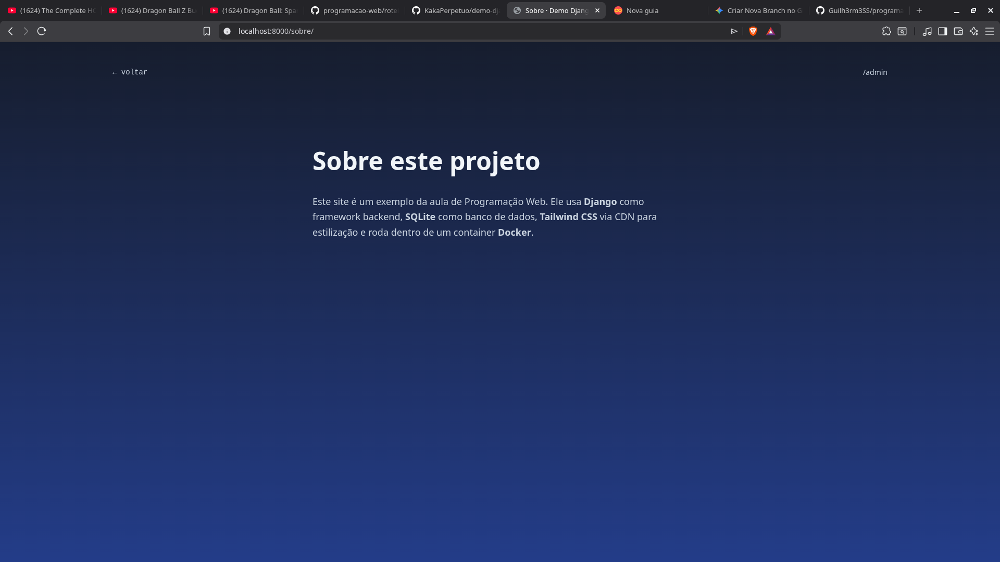

# 🐍 Django + Tailwind CSS - Programação Web Parte II

Este é um projeto de demonstração desenvolvido para a aula de **Programação Web**. Ele apresenta uma aplicação Django simples integrada com Tailwind CSS, rodando em ambiente containerizado com Docker e utilizando o banco de dados local SQLite.

---

## 📸 Capturas de Tela

Aqui estão algumas capturas de tela do projeto em funcionamento:

### Página Inicial
A interface exibe as mensagens do banco de dados de forma responsiva, com efeitos interativos como zoom ao passar o mouse (`hover:scale-105`) e animações.



### Página Sobre / Painel Admin
Outra visualização do projeto demonstrando a estrutura de navegação e estilização:




---

## 🚀 Como Executar o Projeto

Este projeto possui suporte a Docker Compose e inclui um arquivo `makefile` para facilitar a execução de comandos comuns.

### Pré-requisitos
*   [Docker](https://docs.docker.com/get-docker/) e [Docker Compose](https://docs.docker.com/compose/install/) instalados.
*   Ferramenta `make` instalada (opcional, para usar os atalhos).

### Comandos Principais

*   **Construir e iniciar os containers em segundo plano:**
    ```bash
    make build
    ```
*   **Iniciar os containers (se já estiverem construídos):**
    ```bash
    make up
    ```
*   **Parar e remover os containers:**
    ```bash
    make down
    ```
*   **Gerar novas migrações de banco de dados:**
    ```bash
    make migration
    ```
*   **Executar migrações pendentes no banco:**
    ```bash
    make db_migrate
    ```
*   **Criar um superusuário administrador:**
    ```bash
    make create_user
    ```

---

## 🛠️ Tecnologias Utilizadas
*   **Django 5.1** (Framework Python para a Web)
*   **Tailwind CSS** (Estilização rápida baseada em utilitários via CDN)
*   **SQLite** (Banco de dados leve para desenvolvimento)
*   **Docker & Docker Compose** (Containerização e padronização do ambiente)
